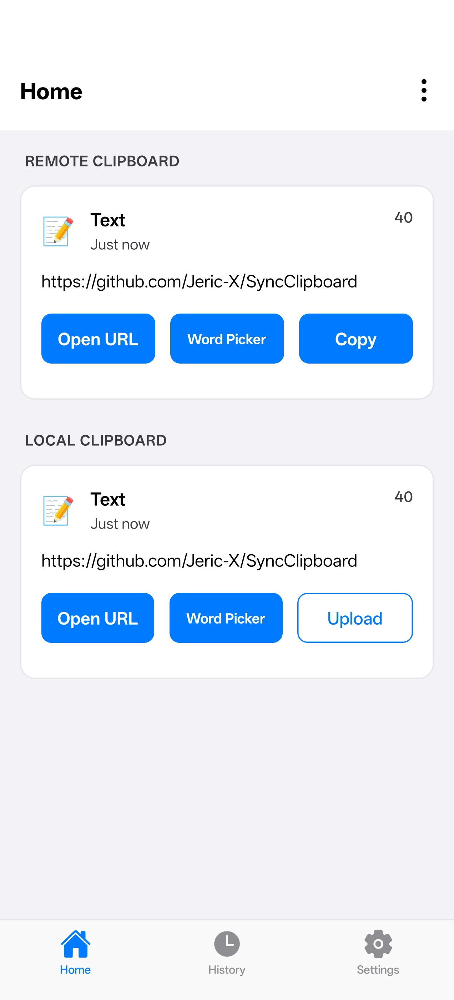
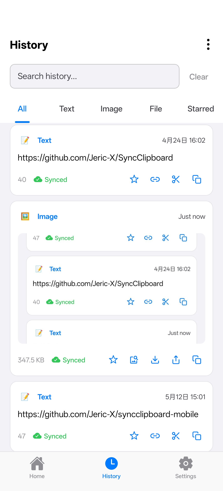
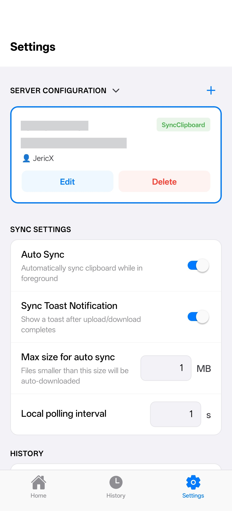

# SyncClipboard Mobile

[中文](README.md) | English

Mobile client for SyncClipboard, currently only supports Android

## Features

### Clipboard Sync and History

- Text, image, and single file clipboard sync
  - Manual sync via notification quick settings, desktop shortcuts, or share menu
  - Automatic background clipboard sync
- History record synchronization
- Automatic SMS verification code upload

### Server Support

- **SyncClipboard Server**
- **WebDAV Server**
- **S3 Object Storage**

## Screenshots

<p align="center">
  
  
  
</p>

## Development

### Install Dependencies

```bash
npm install
```

### Generate Native Projects

```bash
npm run prebuild
```

### Debug Run

```bash
# Android
npm run android

# iOS
npm run ios
```

### Build APK

```bash
npm run build:apk
```

### Other Commands

```bash
# Type check
npm run type-check

# Lint
npm run lint

# Auto-fix linting issues
npm run lint:fix

# Format documents (JSON/Markdown)
npm run format-docs

# Build Expo native plugins
npm run plugin:build
```

## Open Source Dependencies

### JavaScript / TypeScript Dependencies

| Repository                                                                                                        | Description                               |
| ----------------------------------------------------------------------------------------------------------------- | ----------------------------------------- |
| [facebook/react-native](https://github.com/facebook/react-native)                                                 | Cross-platform mobile framework           |
| [expo/expo](https://github.com/expo/expo)                                                                         | React Native toolchain and native modules |
| [react-navigation/react-navigation](https://github.com/react-navigation/react-navigation)                         | Navigation library                        |
| [pmndrs/zustand](https://github.com/pmndrs/zustand)                                                               | Lightweight state management              |
| [Shopify/flash-list](https://github.com/Shopify/flash-list)                                                       | High-performance list rendering           |
| [software-mansion/react-native-reanimated](https://github.com/software-mansion/react-native-reanimated)           | Animation library                         |
| [software-mansion/react-native-gesture-handler](https://github.com/software-mansion/react-native-gesture-handler) | Gesture handling                          |
| [software-mansion/react-native-screens](https://github.com/software-mansion/react-native-screens)                 | Native navigation screen container        |
| [th3rdwave/react-native-safe-area-context](https://github.com/th3rdwave/react-native-safe-area-context)           | Safe area adaptation                      |
| [callstack/react-native-pager-view](https://github.com/callstack/react-native-pager-view)                         | Native pager view                         |
| [satya164/react-native-tab-view](https://github.com/satya164/react-native-tab-view)                               | Tab view                                  |
| [react-native-async-storage/async-storage](https://github.com/react-native-async-storage/async-storage)           | Local key-value storage                   |
| [react-native-netinfo/react-native-netinfo](https://github.com/react-native-netinfo/react-native-netinfo)         | Network state listener                    |
| [axios/axios](https://github.com/axios/axios)                                                                     | HTTP client                               |
| [dotnet/aspnetcore (SignalR)](https://github.com/dotnet/aspnetcore)                                               | Real-time push client                     |
| [expo/vector-icons](https://github.com/expo/vector-icons)                                                         | Vector icon library                       |
| [jiang0508/react-native-feather](https://github.com/jiang0508/react-native-feather)                               | Feather icon components                   |
| [onubo/react-native-logs](https://github.com/onubo/react-native-logs)                                             | Logging utility                           |
| [margelo/react-native-worklets](https://github.com/margelo/react-native-worklets)                                 | JS Worklets runtime                       |
| [emn178/js-sha256](https://github.com/emn178/js-sha256)                                                           | SHA-256 hash calculation                  |
| [linonetwo/segmentit](https://github.com/linonetwo/segmentit)                                                     | Chinese word segmentation                 |

### Android Dependencies

| Repository                                                                                                            | Description                                  |
| --------------------------------------------------------------------------------------------------------------------- | -------------------------------------------- |
| [facebook/react-native](https://github.com/facebook/react-native)                                                     | React Native Android runtime                 |
| [facebook/hermes](https://github.com/facebook/hermes)                                                                 | Hermes JavaScript engine                     |
| [react-native-community/jsc-android-buildscripts](https://github.com/react-native-community/jsc-android-buildscripts) | JavaScriptCore Android engine (alternative)  |
| [RikkaApps/Shizuku](https://github.com/RikkaApps/Shizuku)                                                             | Shizuku API: System API access without root  |
| [dotnet/aspnetcore (SignalR Java Client)](https://github.com/dotnet/aspnetcore)                                       | SignalR real-time push (Java/Android client) |
| [google/gson](https://github.com/google/gson)                                                                         | JSON serialization (SignalR protocol layer)  |
